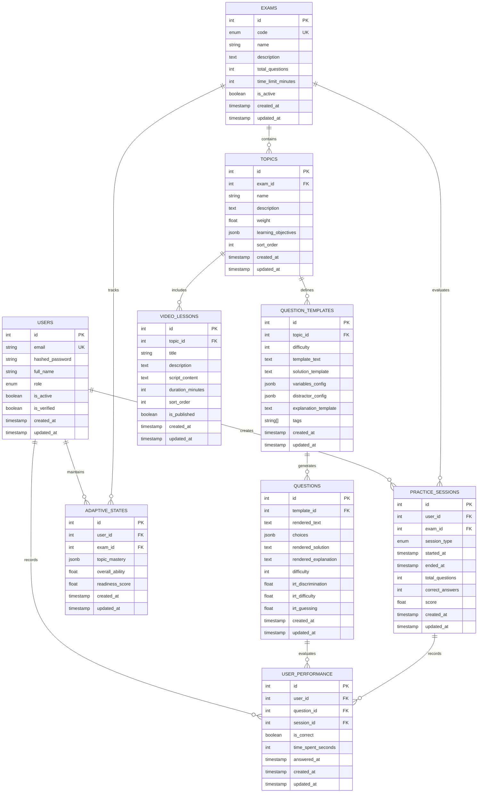

# Database Schema

## Overview

This document describes the complete database schema for the SOA Actuarial Exam Prep Platform using SQLAlchemy 2.0 with PostgreSQL.

## Entity Relationship Diagram

## Tables

### USERS
Stores user account information and authentication credentials.

| Column | Type | Constraints | Notes |
|--------|------|-------------|-------|
| id | INTEGER | PK, AUTO_INCREMENT | Primary key |
| email | VARCHAR(255) | UNIQUE, NOT NULL | User email address |
| hashed_password | VARCHAR(255) | NOT NULL | Bcrypt hashed password |
| full_name | VARCHAR(255) | NULLABLE | User's full name |
| role | ENUM | NOT NULL, DEFAULT='student' | student, admin, content_creator |
| is_active | BOOLEAN | NOT NULL, DEFAULT=TRUE | Account active status |
| is_verified | BOOLEAN | NOT NULL, DEFAULT=FALSE | Email verification status |
| created_at | TIMESTAMP TZ | NOT NULL | Creation timestamp |
| updated_at | TIMESTAMP TZ | NOT NULL | Last update timestamp |

**Indexes:** 
- `email` (unique)

---

### EXAMS
Represents SOA actuarial exams (P, FM, FAM, etc.).

| Column | Type | Constraints | Notes |
|--------|------|-------------|-------|
| id | INTEGER | PK, AUTO_INCREMENT | Primary key |
| code | VARCHAR(10) | UNIQUE, NOT NULL | P, FM, FAM, ALTAM, ASTAM, SRM, PA |
| name | VARCHAR(255) | NOT NULL | Exam full name |
| description | TEXT | NULLABLE | Exam description |
| total_questions | INTEGER | NOT NULL | Number of questions on exam |
| time_limit_minutes | INTEGER | NOT NULL | Time limit in minutes |
| is_active | BOOLEAN | NOT NULL, DEFAULT=TRUE | Exam availability |
| created_at | TIMESTAMP TZ | NOT NULL | Creation timestamp |
| updated_at | TIMESTAMP TZ | NOT NULL | Last update timestamp |

**Indexes:** 
- `code` (unique)
- `is_active`

---

### TOPICS
Exam topics/sections within each exam.

| Column | Type | Constraints | Notes |
|--------|------|-------------|-------|
| id | INTEGER | PK, AUTO_INCREMENT | Primary key |
| exam_id | INTEGER | FK → EXAMS.id, NOT NULL, CASCADE | Parent exam |
| name | VARCHAR(255) | NOT NULL | Topic name |
| description | TEXT | NULLABLE | Topic description |
| weight | FLOAT | NOT NULL, DEFAULT=0.0 | Syllabus weight (0-1) |
| learning_objectives | JSONB | NULLABLE | Array of learning objectives |
| sort_order | INTEGER | NOT NULL, DEFAULT=0 | Display order |
| created_at | TIMESTAMP TZ | NOT NULL | Creation timestamp |
| updated_at | TIMESTAMP TZ | NOT NULL | Last update timestamp |

**Indexes:** 
- `exam_id`
- `(exam_id, sort_order)`

---

### QUESTION_TEMPLATES
Parameterized question templates for dynamic question generation.

| Column | Type | Constraints | Notes |
|--------|------|-------------|-------|
| id | INTEGER | PK, AUTO_INCREMENT | Primary key |
| topic_id | INTEGER | FK → TOPICS.id, NOT NULL, CASCADE | Parent topic |
| difficulty | INTEGER | NOT NULL | Difficulty 1-10 |
| template_text | TEXT | NOT NULL | Question template with {variable} placeholders |
| solution_template | TEXT | NOT NULL | Solution template with {variable} placeholders |
| variables_config | JSONB | NOT NULL, DEFAULT={} | Variable definitions, types, ranges |
| distractor_config | JSONB | NOT NULL, DEFAULT={} | Distractor generation config |
| explanation_template | TEXT | NULLABLE | Explanation template |
| tags | TEXT[] | NULLABLE | Question tags for categorization |
| created_at | TIMESTAMP TZ | NOT NULL | Creation timestamp |
| updated_at | TIMESTAMP TZ | NOT NULL | Last update timestamp |

**Indexes:** 
- `topic_id`

---

### QUESTIONS
Rendered instances of question templates.

| Column | Type | Constraints | Notes |
|--------|------|-------------|-------|
| id | INTEGER | PK, AUTO_INCREMENT | Primary key |
| template_id | INTEGER | FK → QUESTION_TEMPLATES.id, NOT NULL, CASCADE | Parent template |
| rendered_text | TEXT | NOT NULL | Rendered question text |
| choices | JSONB | NOT NULL, DEFAULT=[] | Array of {label, text, is_correct} objects |
| rendered_solution | TEXT | NOT NULL | Rendered solution |
| rendered_explanation | TEXT | NULLABLE | Rendered explanation |
| difficulty | INTEGER | NOT NULL | Difficulty 1-10 |
| irt_discrimination | FLOAT | NULLABLE | IRT discrimination parameter |
| irt_difficulty | FLOAT | NULLABLE | IRT difficulty parameter |
| irt_guessing | FLOAT | NULLABLE | IRT guessing/pseudo-guessing parameter |
| created_at | TIMESTAMP TZ | NOT NULL | Creation timestamp |
| updated_at | TIMESTAMP TZ | NOT NULL | Last update timestamp |

**Indexes:** 
- `template_id`

---

### USER_PERFORMANCE
Individual question attempts and performance data.

| Column | Type | Constraints | Notes |
|--------|------|-------------|-------|
| id | INTEGER | PK, AUTO_INCREMENT | Primary key |
| user_id | INTEGER | FK → USERS.id, NOT NULL, CASCADE | Student |
| question_id | INTEGER | FK → QUESTIONS.id, NOT NULL, CASCADE | Question attempted |
| session_id | INTEGER | FK → PRACTICE_SESSIONS.id, NOT NULL, CASCADE | Practice session |
| is_correct | BOOLEAN | NOT NULL | Whether answer was correct |
| time_spent_seconds | INTEGER | NOT NULL, DEFAULT=0 | Time spent on question |
| answered_at | TIMESTAMP TZ | NOT NULL | Timestamp of answer |
| created_at | TIMESTAMP TZ | NOT NULL | Creation timestamp |
| updated_at | TIMESTAMP TZ | NOT NULL | Last update timestamp |

**Indexes:** 
- `user_id`
- `question_id`
- `session_id`
- `(user_id, question_id)` for aggregate stats

---

### ADAPTIVE_STATES
Tracks user ability and mastery state for adaptive learning.

| Column | Type | Constraints | Notes |
|--------|------|-------------|-------|
| id | INTEGER | PK, AUTO_INCREMENT | Primary key |
| user_id | INTEGER | FK → USERS.id, NOT NULL, CASCADE | Student |
| exam_id | INTEGER | FK → EXAMS.id, NOT NULL, CASCADE | Exam being tracked |
| topic_mastery | JSONB | NOT NULL, DEFAULT={} | {topic_id: {ability, confidence, n_attempts, n_correct}} |
| overall_ability | FLOAT | NOT NULL, DEFAULT=0.0 | Overall ability estimate (IRT theta) |
| readiness_score | FLOAT | NOT NULL, DEFAULT=0.0 | Exam readiness 0-1 |
| created_at | TIMESTAMP TZ | NOT NULL | Creation timestamp |
| updated_at | TIMESTAMP TZ | NOT NULL | Last update timestamp |

**Indexes:** 
- `user_id`
- `exam_id`
- `(user_id, exam_id)` unique

---

### PRACTICE_SESSIONS
Practice exam and quiz sessions.

| Column | Type | Constraints | Notes |
|--------|------|-------------|-------|
| id | INTEGER | PK, AUTO_INCREMENT | Primary key |
| user_id | INTEGER | FK → USERS.id, NOT NULL, CASCADE | Student |
| exam_id | INTEGER | FK → EXAMS.id, NOT NULL, CASCADE | Exam being practiced |
| session_type | ENUM | NOT NULL | adaptive, topic_quiz, timed_exam |
| started_at | TIMESTAMP TZ | NOT NULL | Session start time |
| ended_at | TIMESTAMP TZ | NULLABLE | Session end time |
| total_questions | INTEGER | NOT NULL, DEFAULT=0 | Total questions in session |
| correct_answers | INTEGER | NOT NULL, DEFAULT=0 | Correct answer count |
| score | FLOAT | NULLABLE | Final score (percent or raw) |
| created_at | TIMESTAMP TZ | NOT NULL | Creation timestamp |
| updated_at | TIMESTAMP TZ | NOT NULL | Last update timestamp |

**Indexes:** 
- `user_id`
- `exam_id`
- `(user_id, exam_id)` for user's exam history

---

### VIDEO_LESSONS
Educational video content for topics.

| Column | Type | Constraints | Notes |
|--------|------|-------------|-------|
| id | INTEGER | PK, AUTO_INCREMENT | Primary key |
| topic_id | INTEGER | FK → TOPICS.id, NOT NULL, CASCADE | Parent topic |
| title | VARCHAR(255) | NOT NULL | Video title |
| description | TEXT | NULLABLE | Video description |
| script_content | TEXT | NOT NULL | Full video script |
| duration_minutes | INTEGER | NOT NULL, DEFAULT=0 | Video duration in minutes |
| sort_order | INTEGER | NOT NULL, DEFAULT=0 | Display order within topic |
| is_published | BOOLEAN | NOT NULL, DEFAULT=FALSE | Publication status |
| created_at | TIMESTAMP TZ | NOT NULL | Creation timestamp |
| updated_at | TIMESTAMP TZ | NOT NULL | Last update timestamp |

**Indexes:** 
- `topic_id`
- `(topic_id, sort_order)` for ordered retrieval
- `is_published` for filtering

---

## Key Design Decisions

### 1. Cascading Deletes
All foreign keys use `ON DELETE CASCADE` to ensure referential integrity:
- Deleting an exam cascades to topics, question templates, and questions
- Deleting a topic cascades to questions and video lessons
- Deleting a user cascades to performance records and sessions

### 2. Timestamps
All tables include `created_at` and `updated_at` fields with timezone awareness:
- Automatically set on creation
- Updated on modification
- Support audit trails and change tracking

### 3. JSONB Fields
Strategic use of PostgreSQL JSONB for flexible, semi-structured data:
- `learning_objectives`: Array of learning objectives in any format
- `variables_config`: Variable definitions for question generation
- `distractor_config`: Distractor generation rules
- `choices`: Multiple choice options with metadata
- `topic_mastery`: Per-topic ability tracking by exam

### 4. Enum Types
Strong typing for business logic enums:
- `UserRole`: student, admin, content_creator
- `ExamCode`: P, FM, FAM, ALTAM, ASTAM, SRM, PA
- `SessionType`: adaptive, topic_quiz, timed_exam

### 5. IRT Parameters
Question tables include Item Response Theory parameters:
- `irt_discrimination`: How well question differentiates high/low performers
- `irt_difficulty`: Item difficulty on latent ability scale
- `irt_guessing`: Probability of correct answer by random guessing

### 6. Adaptive Learning State
`AdaptiveState` tracks granular mastery per topic:
- Stores ability estimates and confidence per topic
- Tracks attempt counts and correct answer counts
- Enables topic-level adaptive content sequencing

### 7. Indexing Strategy
Indexes optimized for common queries:
- Foreign key columns indexed for joins
- Composite indexes for multi-column filters
- Unique indexes for email and exam code
- Partial indexes on boolean flags for filtering

## Migration Considerations

- Use Alembic for schema versioning
- JSONB columns are flexible but require application-level validation
- IRT parameters can be populated asynchronously during model calibration
- Topic mastery data structure should be validated on write
